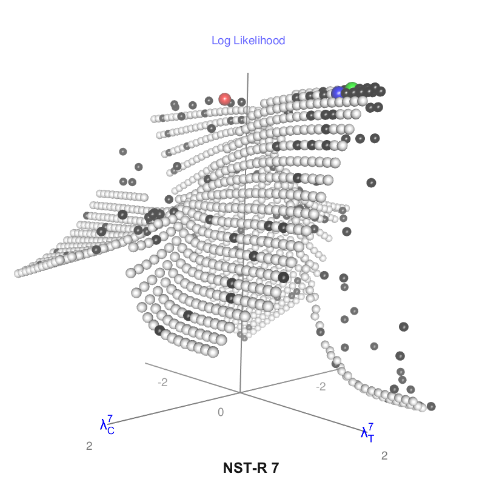

# Fast identification of good lambda's values for Box-Cox transforms

Transportation costs, transit times and trip lengths are often included in random utility functions
used in multinomial logit models. As they are correlated, Box-Cox transformations may help to obtain
better estimators with the expected signs. 

This project presents, in a systematic and visual way, the impact that Box-Cox transforms have on the 
Log-Likelihood of the models. 

It also presents a specific shotgun hill climbing meta-heuristic with backtracking capabilities,
able to quickly identify the optimal Box-Cox lambda parameters to use when multiple independent 
variables must be transformed. 

A special attention is paid to its simplicity, in order to make its implementation easy 
by practitioners in the framework of real-world problems.

## Input data
A complete large dataset is included, representing freight transport in Europe by road, inland
waterways and railways, for 10 groups of commodities (NST/R chapters 0-9). The origin-destination
matrices and the networks come from the [ETISPlus](https://cordis.europa.eu/project/id/233596) 
FP7 European research project. The input data for the logit models (cost, transit time and trip
length for all the origin-destination pairs and group of commodities) were computed using the
[Nodus](http://nodus.uclouvain.be) freight transportation network model. The data is stored in 
the "europeL2-Input.Rda" file, which includes a single R dataframe named "inputData".

A complete discussion on how to implement a weighted conditional multinomial logit model
on aggregated data using the same dataset as the one included in this project can be found in
[Cost, transit time and speed elasticity calculations for the European continental 
freight transport](https://doi.org/10.1016/j.tranpol.2019.08.009). Specific R code used
for this publication can also be found in the [BoxCoxLogit](https://github.com/jourquin/BoxCoxLogit)
GitHub project.

## Brute force solutions
The "BruteForce.R" script computes a logit model using  utility functions with one, two or three 
explanatory variables that are Box-Cox transformed. All the (combinations) of lambda('s) are tested 
in a given range and for a given granularity (step size). The range is set to -2:+2 with a step 
of 0.1, but these values can be changed. By default, 41 values of lambda are thus tested for each 
independent variable. That means that 41 logit models are computed for the univariate case, but 
that 41² and 41³ logits must be computed for the bivariate and trivariate cases respectively. 
As the dataset contains figures for 10 groups of commodities, the amount of logits to compute f
or the univariate, bivariate and trivariate cases are equal to 410, 16 810 and 689 210, 
which can take a very long computing time. Therefore, the results for the three cases are provided 
in the "europeL2-01-BruteForceX.Rda", where "X" is equal to "1", "2" or "3". The "01" in the name 
of the file indicates that the problem was solved with a step of 0.1.

Each of these files contain a single dataframe named "bfSolutions". It contains a row for every lambda
or combinations of lambda's and group of commodities. Each row contains the Log-Likelihood of the model, 
the values of the estimated parameters and their level of significance. An "error" code is also given:
a blank value means that the model gives the expected (negative) sign for the estimators of all the 
explanatory variables and that all the estimators are highly significant ('***' by default). These 
solutions will be further considered as "valid" solutions, among which the best must be retained. 
The latest can be identified reading the "best" column, which contains one single "TRUE" for each group
of commodities.

## Heuristic solutions
In order to reduce the needed logits to compute, a meta-heuristic is proposed, 
explained and validated in "Heuristic.pdf". Its R implementation is proposed in "Heuristic.R". 
This script uses the same input data as "BruteForce.R" and it can be run for a given group of 
commodities and for 1, 2 or 3 explanatory variables.

The "HeuristicVsBruteForce.R" script compares the results of the heuristic to the "exact" best solutions
identified by the brute force approach. A complete discussion about this can be found in the
"validation" section of "Heuristic.pdf". This script also stores the solutions tested by the heuristic
in the "europeL2-01-HeuristicX.Rda" files, which contain a single dataframe named "heuristicPath".
This output can be used to plot the "path" used by the heuristic towards a solution.  

## Plots
The "Plot-BC1.R", "Plot-BC2.R" and "Plot-BC3.R" propose interactive plots that illustrate the 
impact of the combination(s) of lambda('s) on the Log-Likelihood in the cases of univariate, 
bivariate and trivariate cases. The "group" variable can be modified to choose the group of
commodities to plot. One can also plot the unconstrained max Log-Likelighood if wanted. It is
represented by a red dot if it is different from the best "valid" solution (green dot). 

Finally, one can also plot the solutions tested by the heuristic during its path towards a solution. 
These solutions are represented by black dots and the final solution is represented by a blue dot if it is
different from the "exact" best solution identified by the brute force approach (green dot).

Note that some black dots can be "in the middle of nowhere". These are solutions tested during
the first phase of the heuristic (random draws of combinations of lambdas) and that don't 
correspond to "valid" solutions.

This is an example plot (bivariate case, NST-R 5):

## Other R scripts
The  main R scripts are those that are cited before (BruteForce.R, Heuristic.R, HeuristicVsBruteForce.R 
and the three Plot-BCX.R scripts).

Some pieces of R code are common to several scripts. They are "sourced" from within the main
scripts:
- \_BoxCoxLogitSolver : prepares the data for a weighted conditional multinomial logit and
solves it using the [mnlogit](https://cran.r-project.org/package=mnlogit) R package. It
returns the solved model.
- \_Utils.R : several convenience functions: testing signs of the estimators, retrieving their 
significance level, draw random combinations of lambda's...
- \_PlotSettings.R : contains group specific settings used to "optimize" the visual perspectives
of the plots. Used to make the comparison of the plots easier.

## Hash table
The heuristic stores the already solved logit models in a hash table, which key is based
on the lambda's used for their Box-Cox transform. Therefore, the script uses the
[ht](https://github.com/nfultz/ht) package, a minimal implementation of a hash table using 
the [digest](https://cran.r-project.org/package=digest) package. As ht is not available on CRAN, 
a compiled version is provided with this project (ht_1.0.tgz). The package will be automatically 
installed when the script is run. Note that the [digest](https://cran.r-project.org/package=digest)
package must be installed from CRAN.

This particular implementation of an hash table for R is interesting if one needs to store
arbitrarily complex objects (a combination of lambda's in this case) as keys in a hash.

## Needed R packages
The following R packages (available on CRAN) are needed to run the scripts: 
[car](https://cran.r-project.org/package=car),
[digest](https://cran.r-project.org/package=digest),
[mlogit](https://cran.r-project.org/package=mlogit), 
[mnlogit](https://cran.r-project.org/package=mnlogit), 
[rgl](https://cran.r-project.org/package=rgl).

